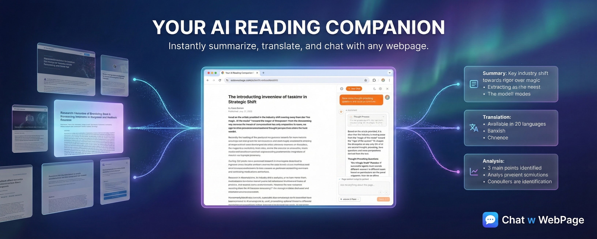

# Chat w WebPage

**Transform your web reading experience with World-Class AI.**

Chat w WebPage is a powerful Chrome extension that allows you to summarize, analyze, and chat with any webpage content using your preferred AI models. Unlike other tools, we prioritize your freedom and privacy.

## ✨ Key Features

### 🤖 Support 12+ Top-tier Models (BYOK)
Don't be locked into a single provider. We support all major AI models directly. Bring Your Own Key (BYOK) for maximum flexibility and cost control.
*   **OpenAI**: GPT-5, o1
*   **Anthropic**: Claude 4.5 Sonnet
*   **Google**: Gemini 3 Pro
*   **DeepSeek**: DeepSeek V3, R1
*   **Local Models**: Ollama, LM Studio (via local server)
*   ...and many more via Azure, Grok, OpenRouter, and SiliconFlow.

### 🔒 Privacy First Design
We built this because we value privacy.
*   **Local Storage**: Your API keys and conversation history are encrypted and stored locally in your browser (IndexedDB).
*   **Direct Connection**: Requests are sent directly from your browser to the AI provider.
*   **No Middleman**: We do not collect or store your conversation data.

### 🧠 Reasoning Visualization
Watch the AI think. Uniquely designed to visualize the step-by-step reasoning process of advanced models like **OpenAI o1** and **DeepSeek Reasoner**, helping you understand complex logic instantly.

### ⚡ Instant Productivity
*   **One-Click Summaries**: Get the gist of long articles in seconds.
*   **Smart Translation**: Auto-detect language and translate with context.
*   **Custom Personas**: Create and save your own AI assistants for coding, writing, or legal review.

## 🚀 Get Started

The extension is **free to use**. You only pay the AI providers for the models you choose to use.

[**Download for Chrome**](https://chatpage.haoba.com)

## 🐛 Feedback & Support

If you encounter any bugs or have feature requests, please [submit an issue](https://github.com/Caixiaopig/chat-w-webpage/issues) in this repository.

---

&copy; 2026 HaoBa Cloud. All rights reserved.
